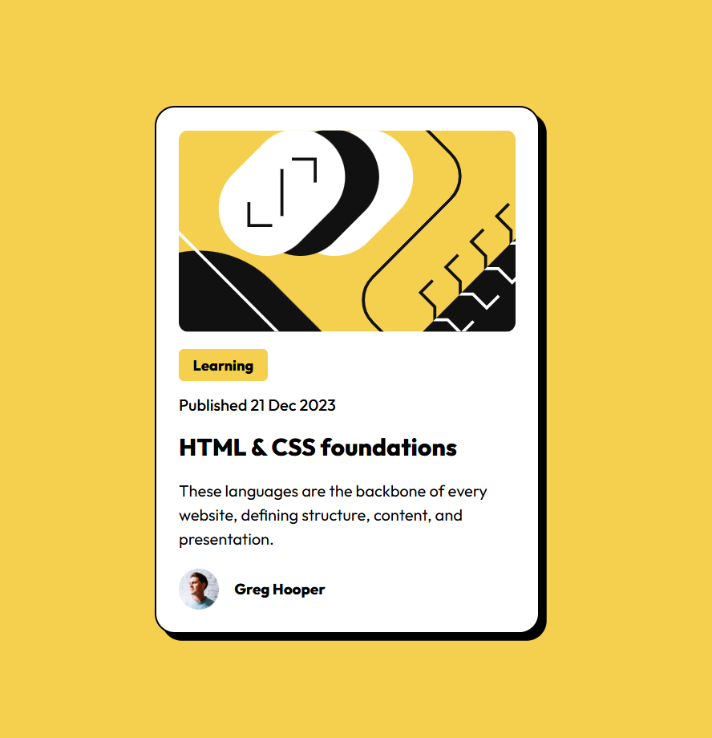

# Frontend Mentor - Blog preview card solution

This is a solution to the [Blog preview card challenge on Frontend Mentor](https://www.frontendmentor.io/challenges/blog-preview-card-ckPaj01IcS). Frontend Mentor challenges help you improve your coding skills by building realistic projects. 

## Table of contents

- [Overview](#overview)
  - [The challenge](#the-challenge)
  - [Screenshot](#screenshot)
- [My process](#my-process)
  - [Built with](#built-with)
  - [Continued development](#continued-development)
  - [Useful resources](#useful-resources)
- [Author](#author)

## Overview

### The challenge

Users should be able to:

- See hover and focus states for all interactive elements on the page

### Screenshot

## My process

### Built with

* Semantic HTML5 markup
* CSS custom properties
* SASS
* Flexbox

### Continued development

In future project I will love to write more of SASS and add some bootstrap to it.

### Useful resources

- [google fonts](https://www.fonts.google.com) - Was able to find the font I used for the project on this site.

## Author

- github - [github profile](https://github.com/markorrente01)
- Frontend Mentor - [@markorrente01](https://www.frontendmentor.io/profile/markorrente01)
